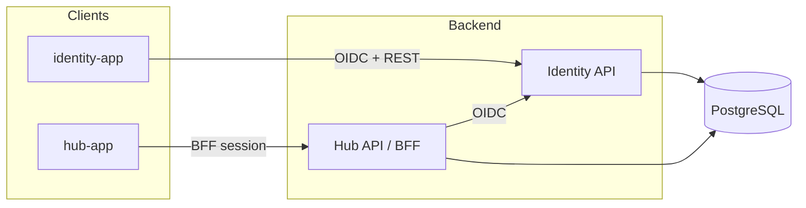

# VyatStat

Platform for organizing events, groups, and trainings — with a dedicated identity service for SSO and permission-based access.

[](LICENSE)
[](https://dotnet.microsoft.com/)
[](https://angular.dev/)

## Overview

VyatStat is a modular system: **Identity** handles accounts and OAuth, **Hub** handles the domain (events, groups, participants, requirements, training). Both backends are ASP.NET Core services; both UIs are Angular SPAs in a single frontend workspace.

Local development is orchestrated by [.NET Aspire](https://learn.microsoft.com/dotnet/aspire/get-started/aspire-overview): PostgreSQL, APIs, and SPAs start together, with URLs and connection strings injected at runtime.

## Features

**Identity**

- Single sign-on across client apps (IdP cookie + OAuth 2.0 / OpenID Connect)
- Authorization Code flow with PKCE, refresh tokens, and client credentials
- Registration, profile, and password change
- Permission-based user administration (list, lock, update claims)

**Hub**

- Event lifecycle: draft → registration → in progress → completed / cancelled
- Participants, roles, locations, and rich-text descriptions
- Requirements with role, participant, and rule verifiers
- Groups, membership, and attaching events to groups
- BFF session for the Hub SPA (cookie + OpenID Connect)

API reference is available via [Scalar](https://scalar.com/) in Development.

## Architecture



| Layer | Stack |
| --- | --- |
| Identity API | ASP.NET Core, ASP.NET Identity, OpenIddict, EF Core |
| Hub API | ASP.NET Core, Clean Architecture, EF Core, Ardalis Result / Specification |
| Frontend | Angular 22, standalone components, Signals, shared `@vyatka-tracker/auth` and `@vyatka-tracker/ui` |
| Data | PostgreSQL |
| Local orchestration | .NET Aspire, Docker (Postgres + pgAdmin) |

Hub follows Presentation → Application → Domain / Infrastructure. The Angular Hub app mirrors that split (`presentation/`, `application/`, `infrastructure/`). Identity is a focused IdP + user API with a dedicated SPA as the login UI for all OAuth clients.

## Repository layout

```text
.
├── docs/
│   ├── prds/                 Product requirements
│   └── design/               UI sketches and design tokens
├── src/
│   ├── Backend/
│   │   ├── AppHost/          Aspire orchestrator
│   │   ├── Identity.WebAPI/  Identity / OIDC server
│   │   ├── Hub.Web/          Hub HTTP API and BFF
│   │   ├── Hub.Application/
│   │   ├── Hub.Domain/
│   │   ├── Hub.Infrastructure/
│   │   └── ServiceDefaults/  Health, OpenTelemetry, service discovery
│   └── Frontend/
│       ├── identity-app/     Identity SPA  (port 4200)
│       ├── hub-app/          Hub SPA       (port 4201)
│       └── libs/
│           ├── auth/         @vyatka-tracker/auth
│           └── shared-ui/    @vyatka-tracker/ui
└── Vyatka.slnx
```

## Getting started

### Prerequisites

- [.NET 10 SDK](https://dotnet.microsoft.com/download)
- [Node.js](https://nodejs.org/) 20.19+ (22 LTS recommended) and npm
- [Docker](https://www.docker.com/products/docker-desktop/) — Aspire runs PostgreSQL in a container

### Run the stack

From the repository root:

```bash
dotnet run --project src/Backend/AppHost
```

Aspire starts Postgres, Identity, Hub, and both SPAs. Open the Aspire dashboard (launched automatically; HTTPS default is `https://localhost:17170`) and use the resource endpoints from there.

Typical local URLs when ports are not remapped:

| Service | URL |
| --- | --- |
| Identity SPA | http://localhost:4200 |
| Hub SPA | http://localhost:4201 |
| Identity API | https://localhost:7019 |
| Hub API | https://localhost:7020 |
| pgAdmin | http://localhost:5050 |
| Scalar (Identity / Hub) | `/scalar` on each API in Development |

On first run Aspire installs frontend dependencies in `src/Frontend`. Databases are migrated and seeded automatically in Development.

**Development admin** (Identity, Development only): login `primary`, password `asd1234`. Do not use this account outside local environments.

## Development

### Backend

Solution file: `Vyatka.slnx`.

```bash
dotnet build Vyatka.slnx
```

Standalone API profiles (need a reachable PostgreSQL and the same OAuth / client URLs that AppHost normally injects):

```bash
dotnet run --project src/Backend/Identity.WebAPI --launch-profile https
dotnet run --project src/Backend/Hub.Web --launch-profile https
```

Connection strings and client URLs live in `appsettings.json` as empty placeholders. AppHost fills `ConnectionStrings:*`, `Idp:*`, `OAuth:*`, and `Clients:*` via environment variables.

### Frontend

Single Angular workspace — one `node_modules`, path-mapped libraries:

```bash
cd src/Frontend
npm install

npm run start:identity   # http://localhost:4200
npm run start:hub        # http://localhost:4201

npm run build            # both apps
npm run test:identity
npm run test:hub
```

Libraries compile from source through TypeScript path mapping. To emit publishable packages:

```bash
npm run build:libs
```

## Documentation

| Resource | Location |
| --- | --- |
| Identity backend | [docs/prds/01_Identity-Backend-Requirements.md](docs/prds/01_Identity-Backend-Requirements.md) |
| Identity frontend | [docs/prds/02_Identity-Frontend-Requirements.md](docs/prds/02_Identity-Frontend-Requirements.md) |
| Design | [docs/design/](docs/design/) |
| Frontend workspace | [src/Frontend/README.md](src/Frontend/README.md) |

Interactive OpenAPI is served by Scalar on each API when `ASPNETCORE_ENVIRONMENT=Development`.

## Contributing

1. Create a branch from the default branch.
2. Keep changes focused; match existing architecture and naming.
3. Build the solution and the frontend apps you touched.
4. Open a pull request with a short summary of *why* the change exists.

Issues and PRs are welcome. If you add behavior, update the relevant PRD under `docs/prds/` when the contract changes.

## License

Licensed under the [Apache License 2.0](LICENSE).
